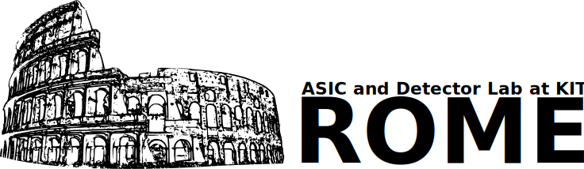

# ROME (ReadOut Modelling Environment)

This is a simulation tool for different readout architectures of synchronous Particle Detectors developed at Karlsruhe Insitute of Technology (KIT) by Rudolf Schimassek and Felix Ehrler in the ASIC and Detector Laboratory (ADL).
The structure of the program is outlined in Auslese-Simulation_170405.mm (A Freeplane mind map)

The simulation aims at synchronous detector architectures. For asynchronous detectors refer to Enrico Junior Schioppa's implementation developed for the MALTA sensor.

The configuration of the simulation is done via XML files. For this, Lee Thomason's XML parsing library tinyxml2 is used (see https://github.com/leethomason/tinyxml2).
The configurable parts include:
* the detector's buffer structure
* the detector's pixels' geometries
* the state machine used for the readout
* the parameters of the event generation including characteristic curves for dead time and time walk

For the characteristics of the deadtime and the time walk q-splines are used. For this, Tino Kluge's implementation (see https://github.com/ttk592/spline/) is used.

For the analysis of the data the Evaluation class (evaluation.h/.cpp) is provided intended for use in the ROOT data analysis framework. An example script if provided in test.cpp.

This software is NOT released jet. It was tested successfully on Ubuntu 16.04LTS compiled with g++ 5.4.0 and there will be no support for this version. Some information is collected on the Wiki page.